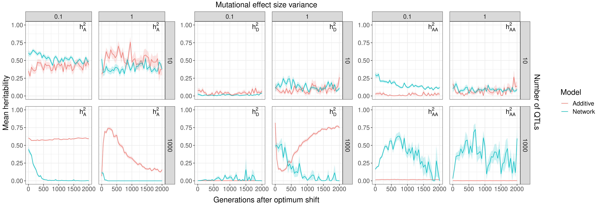
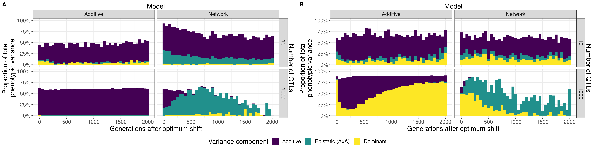

# Get h2 from h2_hsfs_nloci

This job calculates heritability and variance components using sommer mmer functions, using the data from the h2_hsfs_nloci slim experiment. 

wc -l slim_haplos.csv -> 301104000/2000 = 150552 samples

## Results

I started by exploring the effects of each variable on heritability. The selection strength didn't have much of an effect on any heritability (A, D, or AxA) so averaged over it. I also removed the middle QTL number because it was really just an intermediate effect between the extremes (10 and 1000). The same was true with the smallest effect size, which behaved similarly to $\sigma_{loci} = 0.1.

The first result is the heritability over time: additive, dominance and AxA epistatic

The network and additive models behave quite similarly when there are few loci, equilibriating to a similar additive heritability by generation 2000. With many loci, they perform quite differently: network models have very low additivity whereas additive models harbour much greater proportions of additive variance. With small effects, additive models maintain heritability, possibly due to a drift barrier that precludes adaptation, or due to balancing selection that maintains variability. When effects are large, the additive model's heritability decreases as standing variation is used by adaptation. This case is true for both levels of mutational variance in the network model, although with small effects the network model starts with considerably higher $h^2_A$. Over time, $h^2_{AA}$ increases in the network model: it decreases again under small effects, but remains steady (but stochastic) with larger mutational effects. Interestingly, as the additive model uses standing variation and $h^2_A$ decreases, $h^2_D$ increases at a similar rate. Is this evidence of overdominance?

Another way to view this is with a stacked bar chart: 

White space is residual variance. With this view, it is easier to see the difference between additive and network models when there are few loci and small effects (panel A). A small, but reasonable consistent amount of AxA variance contributes to the trait in the network case, and the linear model is able to find more additive variance than in the additive case. This is likely because the network model has larger genetic effects for the same molecular effect size owing to the potential for interactions to enhance genetic effects: the epistatic variance is able to be converted to additive variance during adaptation (which might happen: the amount of epistatic variance does slightly decrease over time).