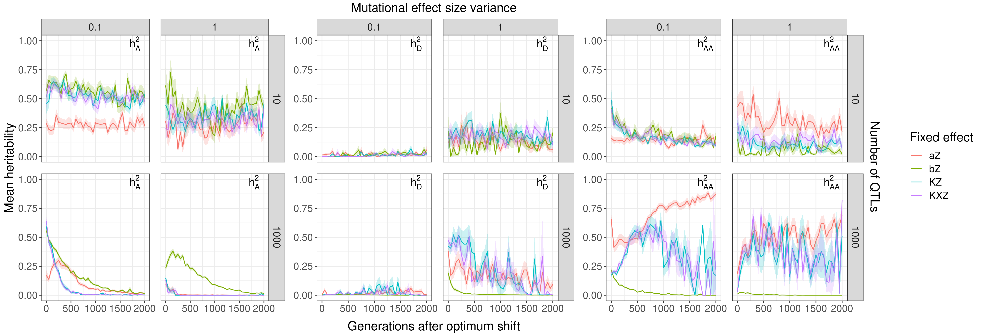
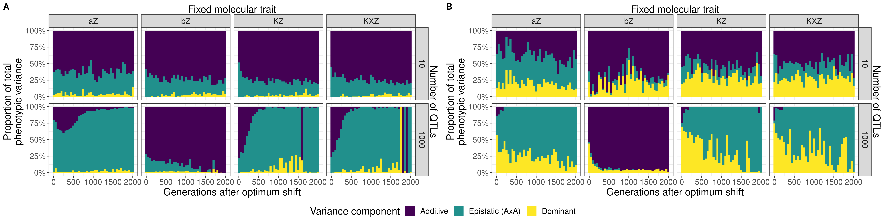
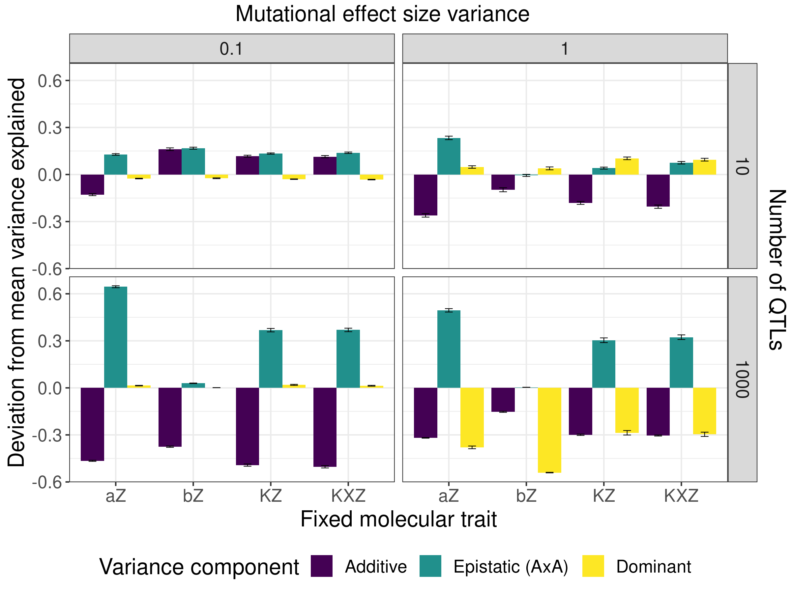
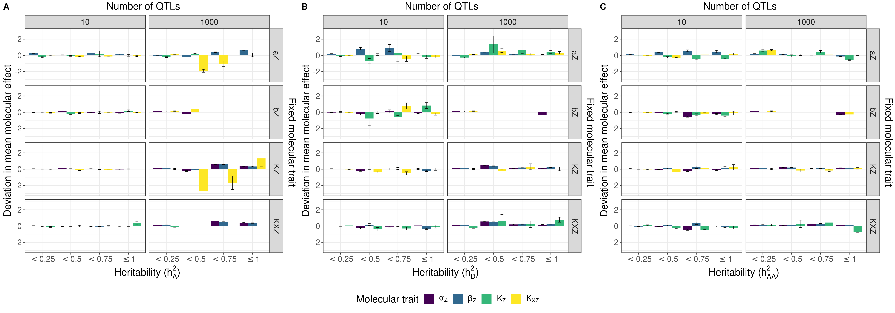

# Get h2 from h2_moltrait_fix

This job calculates heritability and variance components using sommer mmer functions, using the data from the h2_moltrait_fix slim experiment. 

wc -l slim_haplo.csv -> 196800000/2000 = 98400 samples
                        

## Results

I compared the behaviour of these models to those of simulations without any fixations, as well as their individual trajectories. Keep in mind a fixed molecular trait refers to no mutations, and a value = 1.

First is the heritability over time:

I removed selection strength and the intermediate level of QTLs (100) from the dataset because they didn't do much to heritability.

In general, additive heritability is relatively constant over time with few loci. With large molecular effects, fixing any of the traits doesn't appear to have much of an effect. This is because mutations in any of the traits are more likely to be large enough to compensate for the fixed molecular trait. With smaller effects, they are less likely to contribute. When there are small effects, fixing $\alpha_Z$ reduces additive heritability considerably compared to fixing any of the other traits. This suggests that variation in $\alpha_Z$ is responsible for a lot of the additive variance we see in the system. However, epistatic variance doesn't appear to respond to fixed $\alpha_Z$ compared to any other fixed trait for this treatment. 

Noteworthy is that there is nearly no dominance variance when there are small mutational effects.

With many loci, there is a trend for additive variance to decline over time regardless of fixed effect. This reflects Fisher's fundamental theorem, where additive variance in fitness is used during adaptation. However, fixing different molecular traits results in different rates of reduction. With small effects, fixing either $K_Z$ or $K_{XZ}$ results in a more rapid decline, suggesting that $\alpha_Z$ and/or $\beta_Z$ contribute more to the additive response to selection. When $\beta_Z$ is fixed, the population starts with much more additive variation, which suggests that $\alpha_Z$ variance is what contributes most to additive variance in the trait. Populations that were fixed for $\alpha_Z$ or $\beta_Z$ responded more slowly to selection.

When mutational effects were larger, the response was different. Populations started with lower additivity overall, and only fixing $\beta_Z$ led to similar results to the $\sigma_{loci} = 0.1$ case. Fixing the other molecular traits resulted in a rapid decline to close to 0 $h^2_A$. This suggests that when large mutational effects are relatively common, variation in $\beta$ might drive strong epistasis or dominance. This is supported by the second two panels showing $h^2_D$ and $h^2_{AA}$. For the same treatment, fixing $\beta_Z$ results in the lowest levels of both interactions. 

Epistasis was highest at the end of the simulation when $\alpha_Z$ was fixed in a genetic architecture with small mutational effects and many loci. This corroborates with the first panel showing the additive response to selection, showing that $\alpha_Z$ contributes large amounts of additivity to the phenotype compared to the other molecular traits.

The next figure shows the same data stacked so it is easier to see the effects of each molecular trait fixation on the components of variance together:

Panel A shows the heritability estimates when $\sigma_{loci} = 0.1$; Panel B shows heritabilities when $\sigma_{loci} = 1$.
Again, this highlights how removing variation from $\beta_Z$ leads to populations with a lot of additivity, particularly when there are many QTLs and large effects (panel B).

The next figure shows the mean deviation in heritability ($h^2_A$, $h^2_D$, $h^2_{AA}$) from a population with no fixed molecular traits. This is taken across all time points:

So compared to a population without any fixed traits, fixing any of the molecular traits reduces additivity in all cases except for small mutations and few loci. Fixing $\beta_Z$ decreases $h^2_A$ the least in these cases, which aligns with the previous results suggesting that variation in $\beta_Z$ contributes to non-additive variance. However, this is not reflected in the deviation in epistatic variance when $\beta_Z$ is fixed, which is close to 0. Fixing $\beta_Z$ results in nearly no change in $h^2_{AA}$ compared to when it is not fixed. This suggests that in the unrestricted population, almost none of the epistasis seen is due to $\beta_Z$ mutations.

The next figure shows the deviation in mean frequency from models without fixed molecular traits for given levels of heritability. The mutational effect variance was removed as a predictor because it had little effect on mean frequency. The key result is that regardless of the number of QTLs, fixing $\alpha_Z$ increases the mean frequency of $K_{XZ}$ mutations, indicating a compensatory response. The same is seen for $\beta_Z$ mutations but the magnitude of this change is quite small. The mean frequency of $K_Z$ mutations in response to molecular trait fixations is quite variable according to different types of variation. For instance, with few loci, higher $h^2_{AA}$ is associated with decreases in the mean frequency of $K_Z$ mutations when any of the traits are fixed, but especially $\beta_Z$. On the flipside, high $h^2_A$ is associated with a slight increase in $\alpha_Z$ and $K_Z$ mutation frequency when $\beta_Z$ is fixed. 

With many loci, fixing $\beta_Z$ led to cases where there was very little $h^2_A$ and either very little or a lot of $h^2_D$ and $h^2_{AA}$. The small heritabilities for all three were associated with an increase in $K_Z$ relative to no fixed molecular traits, which might be introducing higher order epistatic terms not included in the linear model predicting heritability. The high interaction heritabilities weren't associated with any relative change in allele frequency, suggesting more of a change in the effects themselves.

The next figure plots the effect size of mutations according to heritability:

When there is a polygenic genetic architecture and $\beta_Z$ is fixed, high epistatic heritability is associated with small decreases in $\alpha_Z$ and $\K_{XZ}$. Decreases in $\alpha_Z$ alone is associated with high $h^2_D$. Low $h^2_{AA}$ is associated with small increases in the three unfixed molecular traits.

