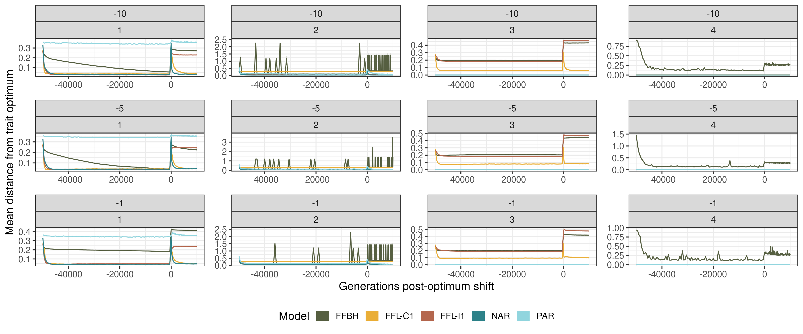

# Multi-Motif pilot simulations

I've run some initial simulations to test each motif's ability to adapt following an optimum shift.
Each population burnt in to a state 10% away from the initial state of the ODE system (when all molecular components = 1).
The optimum shift was then a further 10% away from the burn-in optimum.

Fig. 1 - The mean of mean Mahalanobis distances from the optimum across individuals and replicates. Mahalanobis distance accounts for differences in selection strengths across traits (attributable to differences in trait scale).

Fig. 2 - The mean of mean fitnesses across individuals and replicates. Fitness was calculated via a multivariate normal fitness function.

Figs 1 and 2 show how populations adapted over time. Despite starting at the same fitness deficit, only the NAR populations were able to perfectly match the burn-in optimum, with all other motifs reaching stable points away from the optimum. These might represent local optima on the fitness landscape. The ramifications when the optimum shifts are severe drops in fitness for maladapted motifs because the optimum shift is relative to the burn-in optimum, of which these motifs are not adapted to. Recombination created larger drops in fitness after the optimum shift for the FFBH motif.

Fig. 3 - The mean variance in fitness across across replicates.

Fig 3 shows motifs maintained different variance in fitness: FFBH motifs were most variable, whereas the NAR was the least. Recombination tended to slightly increase variance in fitness, but not by a great deal.

Fig. 4 - Per-trait mean distances from the optimum adjusted for selection strength. Top label is the log10 recombination rate, bottom label is the trait. Note that the traits differ between motifs:

- NAR and PAR traits are (1) response time and (2) steady state concentration; 
- FFL-C1 traits are (1) response time, (2) response delay, and (3) steady state concentration; 
- FFL-I1 traits are (1) time to half-maximum expression, (2) maximum expression concentration, and (3) time above half-maximum expression; 
- FFBH traits are (1) time to half-maximum expression, (2) maximum expression concentration, (3) response time to the second steady state, and (4) the second steady state concentration.

Figure 4 shows how adaptation progressed across all traits for the models. FFBH motifs were limited in reaching the optimum among all traits. The response time to the second steady state especially was limited. Fluctuations in maximum expression concentration show volatility in this trait even with small mutational effects. FFBH populations showed very slow movement to the optimum under low and intermediate recombination in their first trait, the time to half-maximum expression.

PAR populations adapted quickly in steady state concentration, but response time remained unoptimizable. FFL-C1 were the opposite, being able to adjust their response time rapidly but being limited in their ability to adjust steady state concentration beyond a certain limit: the initial change was rapid, but steady state change capped at around 0.1 distance from the optimum. A similar effect was observed for the response delay.

FFL-I1 populations quickly reached the burn-in optimum for time to half-maximum expression, but when the optimum shifted, they remained stable at a maladapted trait value. They were unable to optimise their time above half-maximum expression, despite quickly optimising maximum expression concentration.

## Trait correlations

The adaptation difficulty might be due to trait correlations. Here are figures of the pairwise correlations between trait means. Each point in the plot is a trait mean in a replicate (288 total points in each figure; 3 recombination rates and 96 replicates). Note that because these are trait measurements taking during adaptation, these are a combination of selection and network derived correlations:

### NAR

There is a strong correlation between response time and steady state concentration. The two densities might correspond to time differences (e.g. at the optimum during burn-in vs the shifted optimum), but I need to verify this.

### PAR

The same traits, but they appear much less correlated. A weaker correlation would slow adaptation in this case because the optimum shifts in an increasing direction for both traits simultaneously: hence, a mutation that changes both traits positively will be strongly favoured. This type of mutation might be less likely under the PAR.

### FFL-C1

The FFL-C1 has some strange patterns going on. Especially the correlation between response time and steady state concentration, which is almost logistic, recapitulating the shape of the Hill activation function in its circuit. There are two plateaus where steady state concentration is maintained at a given response time, and a sharp switch between the two states at response time ~ 1.42s. The other two traits don't really seem correlated either, with response delay being confined to very small values, and response time being largely confined to one of two specific values (although there is some variation around those points).

### FFL-I1

Expected correlations: large maximum concentrations are correlated with longer times to reach half-max concentration. Similarly, longer times to reach half-max concentration leaves less time to remain above the half-max concentration threshold. There is some strange sampling going on in the distributions though, especially in time to half max vs time above half-max. Not sure what to make of this one.

### FFBH

For the most complex network, we see relatively weak correlations among traits except for a -0.273 correlation between the response time to second steady state and the time to half maximum concentration. This means that network configurations that take longer to reach the maximum tend to decline rapidly to the second steady state or vice versa. Maximum concentration is heavily restricted, with some outliers producing quite large concentrations, but generally being quite modest.

## Trait distance correlations
In addition to the trait correlations, we can look at correlations among distances to the optimum on each axis. Strong correlations here mean that when one trait is far from the optimum, the other trait tends to be as well. Negative correlations imply that when one trait is maladapted, the other is usually adapted.

### NAR

As expected, distance to the optimum response time and steady state concentration are tightly coupled.

### PAR

The correlation from the NAR model is still there, but weaker: being close to the optimum in one trait does not always guarantee being close to the optimum in the other.

### FFL-C1

There is no correlation between response delay and steady state concentration, meaning that mutations affecting one trait don't always affect the other. Note that these two traits are the ones that hovered slightly away from the optimum.

### FFL-I1

Weaker correlations again (for two of the three combinations) and strange distributions. 

### FFBH

A variety of weaker correlations among half of the pairs, and almost discrete distributions, with distances outside of certain ranges among all traits being inaccessible.

## Conclusions

Together these results show that adaptation in these networks is strongly dependent on initial network configurations, the burn-in optima, and the direction of selection (and how that corresponds to trait correlations). Some future ideas: 

- Maybe we should randomise the direction of selection amongst traits? This will allow us to separate trait correlations from selection.
- It might be a good idea to randomise the initial states of the networks to reduce the effect of this initial state on adaptation. The optima can still be relative to this state (i.e. 10% potential increase in fitness when reaching the optimum).
- It would be good to map out the ruggedness of the fitness landscape in higher dimensions. Perhaps a simple metric like the number of beneficial mutations randomly sampled from a given point in the multidimensional space could give us a simple visual for this: e.g. if there are many beneficial mutations relative to the total sampled, it is likely on the "side" of a fitness incline, especially if the beneficial effect is large. Problem would be effectively sampling this space, but perhaps in a small area around where populations reach/equilibriate would suffice.

# Part II: Randomising selection direction

I ran another test randomising the direction of selection for each trait and how much each trait contributes to the total phenotypic shift.
In this case, some populations in all models were able to reach the optimum:

<table style="text-align:center"><tr><td colspan="6" style="border-bottom: 1px solid black"></td></tr><tr><td style="text-align:left"></td><td>model</td><td>r</td><td>n</td><td>nAdapted</td><td>pAdapted</td></tr>
<tr><td colspan="6" style="border-bottom: 1px solid black"></td></tr><tr><td style="text-align:left">1</td><td>FFBH</td><td>1e-10</td><td>48</td><td>11</td><td>0.229</td></tr>
<tr><td style="text-align:left">2</td><td>FFBH</td><td>1e-05</td><td>48</td><td>10</td><td>0.208</td></tr>
<tr><td style="text-align:left">3</td><td>FFBH</td><td>0.1</td><td>48</td><td>6</td><td>0.125</td></tr>
<tr><td style="text-align:left">4</td><td>FFLC1</td><td>1e-10</td><td>48</td><td>13</td><td>0.271</td></tr>
<tr><td style="text-align:left">5</td><td>FFLC1</td><td>1e-05</td><td>48</td><td>11</td><td>0.229</td></tr>
<tr><td style="text-align:left">6</td><td>FFLC1</td><td>0.1</td><td>48</td><td>8</td><td>0.167</td></tr>
<tr><td style="text-align:left">7</td><td>FFLI1</td><td>1e-10</td><td>48</td><td>11</td><td>0.229</td></tr>
<tr><td style="text-align:left">8</td><td>FFLI1</td><td>1e-05</td><td>48</td><td>12</td><td>0.250</td></tr>
<tr><td style="text-align:left">9</td><td>FFLI1</td><td>0.1</td><td>48</td><td>10</td><td>0.208</td></tr>
<tr><td style="text-align:left">10</td><td>NAR</td><td>1e-10</td><td>48</td><td>48</td><td>1</td></tr>
<tr><td style="text-align:left">11</td><td>NAR</td><td>1e-05</td><td>48</td><td>48</td><td>1</td></tr>
<tr><td style="text-align:left">12</td><td>NAR</td><td>0.1</td><td>48</td><td>48</td><td>1</td></tr>
<tr><td style="text-align:left">13</td><td>PAR</td><td>1e-10</td><td>48</td><td>2</td><td>0.042</td></tr>
<tr><td style="text-align:left">14</td><td>PAR</td><td>1e-05</td><td>48</td><td>6</td><td>0.125</td></tr>
<tr><td style="text-align:left">15</td><td>PAR</td><td>0.1</td><td>48</td><td>5</td><td>0.104</td></tr>
<tr><td colspan="6" style="border-bottom: 1px solid black"></td></tr></table>

So the NAR was able to adapt regardless, the others ranged from about 10% to 25% of the time, except the PAR under 1e-10 recombination which was about 4%. Note that the different models had the same randomly sampled selection strengths/directions per trait owing to shared seeds: differences between recombination rate treatments within models are due to model parameters not due to differences in the randomly chosen trait directions. Between models, they have different numbers of traits so the comparison there doesn't make much sense.

Here are their adaptive walks (average among all populations):

and the individual walks (each line is an independent adapted replicate)

Among replicates, variability in walks seems greatest in the FFBH and FFL-I1 models - property of the model or the walk? Discontinuities in phenotype surface contributing to maladaptation?

Will need to identify the direction of selection for each trait could be the adapted populations for the complex motifs are adapting mainly by 1 or 2 traits instead of all 4. 

Next - choose different starting conditions? All molecular components are at 1 to start with, shape of curve doesn't align with the function of the network (according to literature) - will need to adjust the starting point and make sure the shift is relative to that.

Do we keep the randomised adaptation direction?  

## Fitness landscape ruggedness

I've run some further experiments looking at the ruggedness of the landscape.
In the first attempt, I used gradient descent from randomly sampled spaces in the molecular component space. I used Latin hypercube sampling to sample 10,000
genotypes, and calculated fitness based on those. Then, I used ``optim()`` in R to navigate the molecular component space until a local fitness peak was found.
After replicating this across all sampled genotypes, I identified how similar those sampled genotypes were, and if they were in the same fitness peak. I then computed
the proportion of fitness peaks which were unique across the fitness landscape as a measure of ruggedness.

| model | totalOptima | countUniqueOptima | propUniqueOptima  |
|-------|-------------|-------------------|-------------------|
| NAR   | 9339        | 2542              | 0.272191883499304 |
| PAR   | 8003        | 2862              | 0.357615894039735 |
| FFLC1 | 8412        | 6758              | 0.803376129339039 |
| FFLI1 | 6672        | 5288              | 0.792565947242206 |
| FFBH  | 6662        | 6627              | 0.994746322425698 |

This is more or less expected: the FFBH (the most complex) network is very rugged, whereas the NAR (the least complex network) is the opposite.
I was somewhat skeptical of this result though - identifying the similarity of the sampled genotypes seems prone to error, and it felt like there might have been better methods for solving this problem.

I found a method used by Nosil et al. (2020) which identifies ruggedness differently.
In the method I use Latin hypercube sampling to generate 10,000 random samples of the genotype space and apply the following algorithm to each:
1) Calculate the fitness of the starting point
2) Generate 10 random mutations to create a random walk from the starting point through the genotype space
3) Calculate the fitness of each step in the walk
4) Measure the net change in fitness between the first and last genotypes in the walk
5) Measure the total absolute change in fitness across the whole walk (the sum of absolute differences in fitness between each step)
6) Calculate ruggedness as the difference between the net change and total absolute change 

When random walks result in a monotonic fitness change, these two measures are the same so ruggedness = 0. However, when there are changes in the direction of fitness over the walk, the total absolute change may exceed (or subceed) the net change from start to end. Hence, the larger the difference, the more ruggedness in the landscape.

We see some different results:

So the FFBH is somehow less rugged than the other motifs! And FFL-I1 is even less rugged.
But, there is less movement across each walk as well. So I had a look at the number of walks with at least one invalid phenotype (a fitness hole, i.e. holey landscape)

There are many more holes in the landscape on these two models! So many random walks are unsuccessful because fitness craters. There is significant constraint arising from the genotype-phenotype map. The question is, how likely are each of the molecular components to contribute to evolution? If certain components are under strong selection by increasing the chance that there is an invalid solution, they will likely be held constant and not harbour much additive variance. Need to measure additive variance in each trait to understand this, and see how variance in each molecular component correlates with fitness.