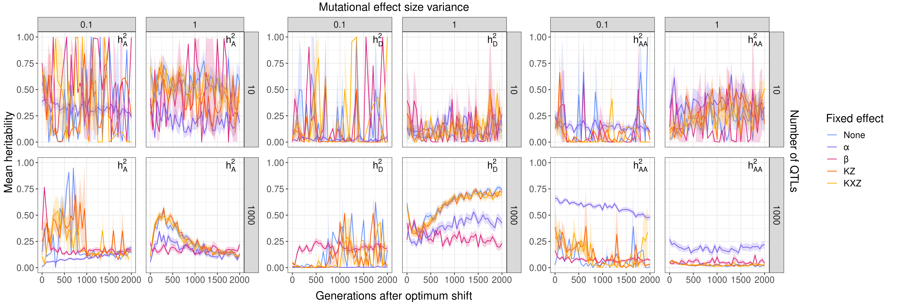
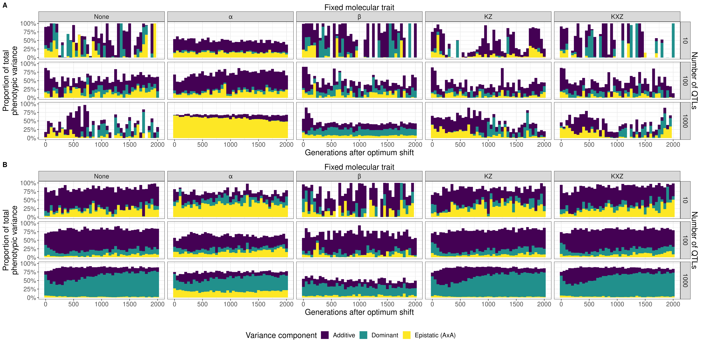
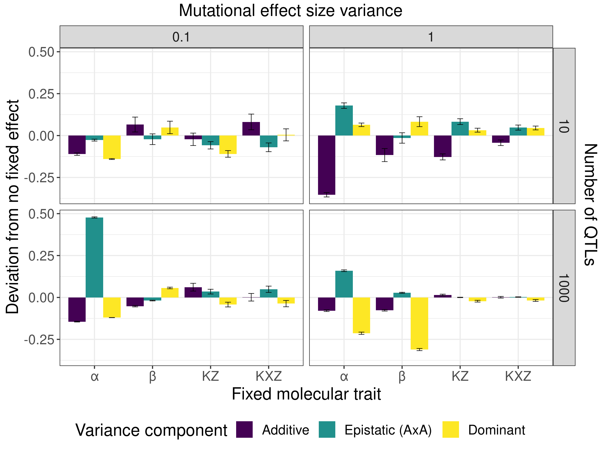
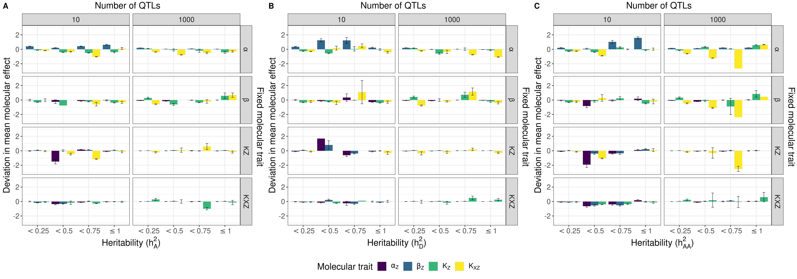

# New crossing design

I found that the network model populations were behaving quite differently to how they did in my confirmation experiments for similar parameter combinations. This is could be due to one of several reasons. The first is the genome length being longer in these simulations than in my confirmation experiments, but I think that is unlikely. Another is the nonWF model having some difference in sampling of offspring, although the sampling method used is very similar to a WF model (it's from the "reconstructing a WF model in a nonWF framework" section in the SLiM manual... so it should be fine). I think the most likely reason is the crossing process itself hampers adaptation considerably in network models by introducing completely different genetic backgrounds whenever there is a cross. This might be why the burn-in looks the same (there is no heritability testing then).

This means the cross-experiment population needs to be completely separate to the breeding population.
To cross the populations, I'll create a new subpopulation, cloning a random sample of individuals and crossing them for a generation before measuring their phenotypes. This means that the sampled individuals will be completely separate from the selection environment.

## Results

I started by plotting the phenotype over time to check my theory:

The result was much closer to my confirmation results, so it looks like I was right. This is interesting because it means there is indeed a lot of epistasis in the population that can have very large effects on the phenotype and on adaptation over long periods. The random crossing of 20% of the population was enough to stop adaptation from happening in prior tests, whereas additive models were unimpeded.

I then plotted the heritability estimates over time:

A bit of a mess for many cases but there are some trends. Firstly, when there is only a small number of loci, there's a lot of turbulence in the heritability estimates. I'm unsure as to why this is: there could be selection for larger effects in these cases. But, the sample sizes for these cases are also small (for sigma = 0.1, many of the estimates have just one measure of heritability), so it could be that fluctuations due to drift could be contributing quite a lot. However, the one key factor is that ficing alpha tends to result in a much more stable $h^2_A$ over time, usually below 0.5. This is also the case for the other two heritabilities. This suggests that $\alpha_Z$ is the major contributor to these large fluctations in the $n_{QTL} = 10$ case. Why would this be over $\beta_Z$, which should have the same effect but inverted? Not sure. 

The trends in polygenic case are more obvious. Fixing $\alpha_Z$ tends to result in low $h^2_A$ and higher $h^2_{AA}$, regardless of effect size. However, with small effects the amount of epistasis this leads to is much greater than under larger effects. This could be due to epistatic variation being cryptic in the population: a mutation might be of small molecular effect, but its genetic effect on the phenotype depends on the genetic background. When the heritability testing cross occurs, all of these alleles are exposed to new genetic backgrounds where they have different genetic effect sizes on the phenotype, even though their molecular effect is the same. This would be detected by the model as large amounts of AxA epistasis due to the different combinations leading to different phenotypes. When there are larger molecular effects (effects on the molecular trait, which are additive), they are more likely to have large genetic effects (the effect of an allele on the phenotype) in many more genetic backgrounds, so they are selected as those large effect mutations rather than the many small effect mutations in the smaller-effect size case. So although there might be some epistasis arising from these larger effects, they would be fewer in number and so they would contribute less variation than the smaller molecular effect alleles selected at other loci.

Dominance looks pretty weird. With small effects, there isn't much of a trend apart from fixing $\beta_Z$ tends to lead to more stable $h^2_D$. This coincides with the declined in $h^2_A$, suggesting a conversion from additive to dominance variance when $\beta$ is fixed. However, with large effects there are more immediately identifiable trends. $h^2_D$ increases gradually over time and $h^2_A$ decreases at a similar rate when there are no fixed effects, or either of the K values are fixed. This suggests that $\alpha$ and $\beta$ are most repsonsible for the dominance variance in the population. Fixing $\alpha$ still results in a slow decline in additivity and a slower increase in dominance, but fixing $\beta$ results in a stable amount of additivity and dominance. This suggests that when there are many loci controlling the trait and a wide distribution of molecular effects, both $\alpha$ and $\beta$ contribute to additivity quite strongly, and $\beta$ even moreso than $\alpha$. 

For another view on this, I plotted a stacked histogram of the components of variance:

(A) is the data where $\sigma = 0.1$ and (B) is where $\sigma = 1$. Immediately it's obvious there is a lot of missing timepoints, particularly in (A). This is likely due to a lack of replicates - I will run this test again over the weekend for some more samples. There also is a fair amount of variance that the models do not explain - this could be higher order epistasis. This is paricularly apparent in (A). It could be that due to the small effects of most mutations, it's difficult to ascribe those genetic effects to phenotypic differences. 

It looks like $\alpha$ contributes quite a lot to additivity: when it is fixed, there is very little additive variance and a lot of epistatic variance (relatively).  This is especially so in (A) when $n_{QTL} = 1000$. It's interesting that there is so much more dominance variation in (B) than in (A) when $\alpha$ is fixed. This could be because of the molecular architecture. Since there is codominance of molecular effects (h = 0.5), going from heterozygous to homozygous doubles the molecular effect of the individual (aa = 0, Aa = 1, AA = 2). If the molecular effect is large, there is likely going to be a larger deviation from linearity when considering the genetic effect of a homozygous AA versus a heterozygous Aa. When the effects are small, this deviation might be smaller, so the main effects on variation come from mixing genetic backgrounds (i.e. epistasis).

Next, I looked at how fixing a molecular trait changed heritability estimates compared to having no fixed effect:

First, I'll look at the polygenic case. Again, when you have many loci, fixing $\alpha$ tends to increase epistasis, especially when you have small effects. This coincides with decreases to additivity and dominance. Fixing $\beta$ has small effects on heritability estimates when effects are small, with slight declines to additivity and AxA and an increase in dominance. With large effects, there is a very large decline in dominance variance, with disproportionate changes to additivity and AxA. The model simply does not explain as much of the phenotypic variance when $\beta$ is fixed in this case. Fixing KZ and KXZ has small effects on heritability estimates, particularly with small molecular effects. When the effects are larger, KXZ has almost no effect on heritability estimates.

The results are much different for the $n_{QTL} = 10$ case, but owing to the gaps in data and the much larger error, I want to run some more replicates to confirm these results. Fixing $\alpha$ results in very large decreases in additivity compared to the polygenic case, suggesting that when there are few loci, $\alpha$ contributes heavily to additivity. This is complimented by further decreases in dominance in the small effects case, and increases to both AxA and dominance in the large effects case, although in both cases these changes don't compensate for the drop in $h^2_A$, so the model explains less variance overall. Fixing $\beta$ resulted in smaller changes to all three $h^2$s, but the error bars are large, so it's unclear if there is real effect of selection or if drift is playing a large role in these differences. With the K values, there does seem to be an effect though: fixing KZ mirrors fixing $\alpha$  at a smaller scale - the effect on heritability is smaller, but also there is only 1 locus compared to 4. Fixing KXZ slightly decreases interaction terms with no change to additivity when there are small effects, and slightly increases interaction terms (while decreasing additivity) under large effects.

Next I measured the mean frequencies of alleles in the fixed-molecular-effect groups as deviations from having no fixed effects. These were groups as mean frequencies of alleles at each type of locus ($\alpha$, $\beta$, KZ, KXZ). These results are averaged over molecular effect sizes; I'll look into those when I have run my extra replicates.

I think the first interesting trend is that fixing $\alpha$ results in large increases to the mean frequency of $K_{XZ}$ alleles across almost all groups. This suggests that $K_{XZ}$ might be able to compensate in some way for the variability that $\alpha$ mutations normally provide. A similar effect is seen when $\beta$ is fixed for $K_Z$ mutations, although it isn't as strong. Another interesting result is that in the polygenic case, when $\beta$ is fixed, there is high $h^2_{AA}$ only when there aren't increases to $K_Z$. I'm unsure if this is an artifact of not enough replicates or an actual result though, so we'll have to wait and see for those extra replicates. Overall there's a lot of information in this figure and it's difficult to read, so I'm trying to think of better ways to visualise the information. I started with SFS but that was even more confusing so chose mean frequency as a proxy. Any pointers would be great!

Coinciding with this information is the molecular effects of the mutations. I took the mean effect of all molecular traits for all fixed effects and calculated its deviation from having no fixed effect similar to the last figure.

Here we see that there isn't as clear a trend with the effect size as the frequency. I think this might be because the decoupling of molecular and genetic effects means that the size of a molecular effect isn't always consistent with the genetic effect size. I think I need some way to measure the genetic effect size, but I'm unsure as to how to do this. 
I think also the extra replicates might help see what's happening here a bit better.

So while this figure is hard to interpret, I can look at the mean molecular trait value instead for a more 'genetic-background-wide' look at the effects. I'll work on this in the coming week.

