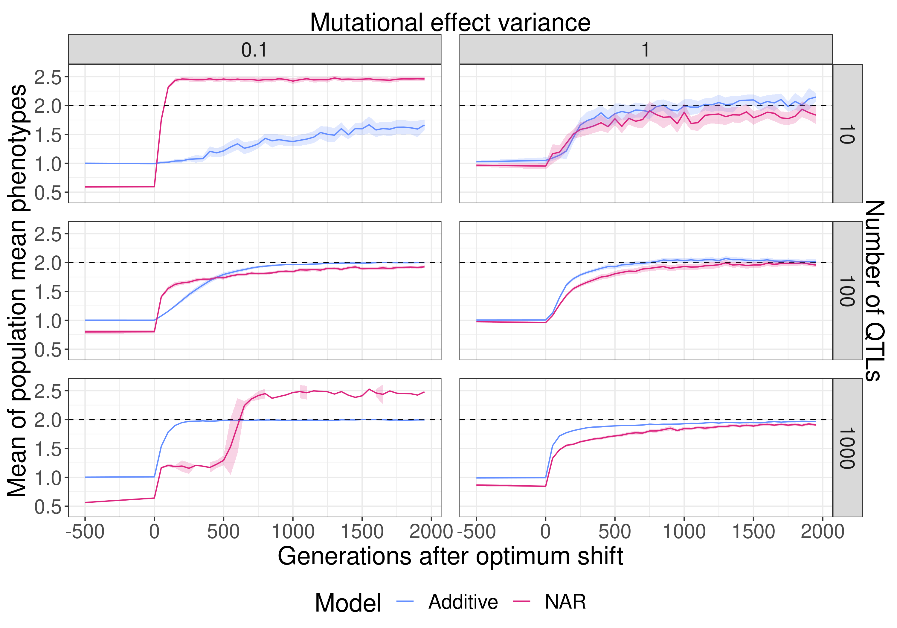
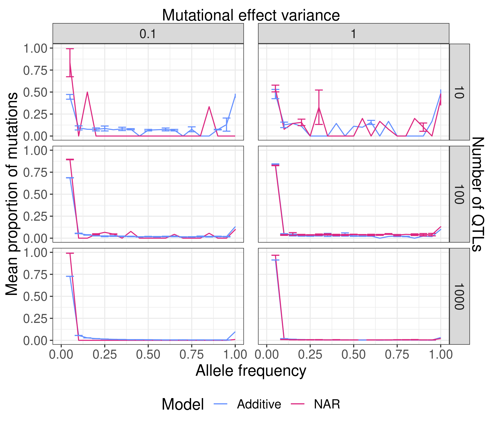
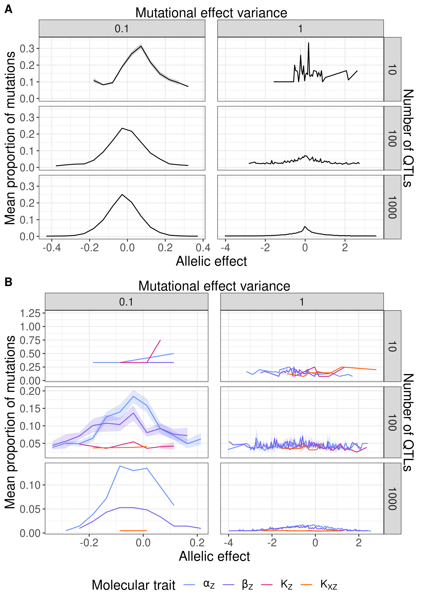
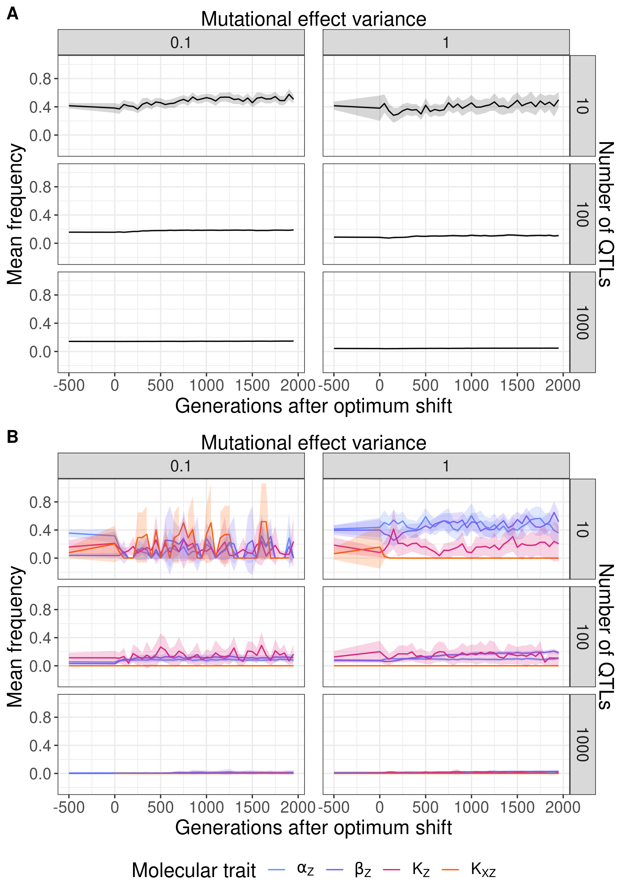
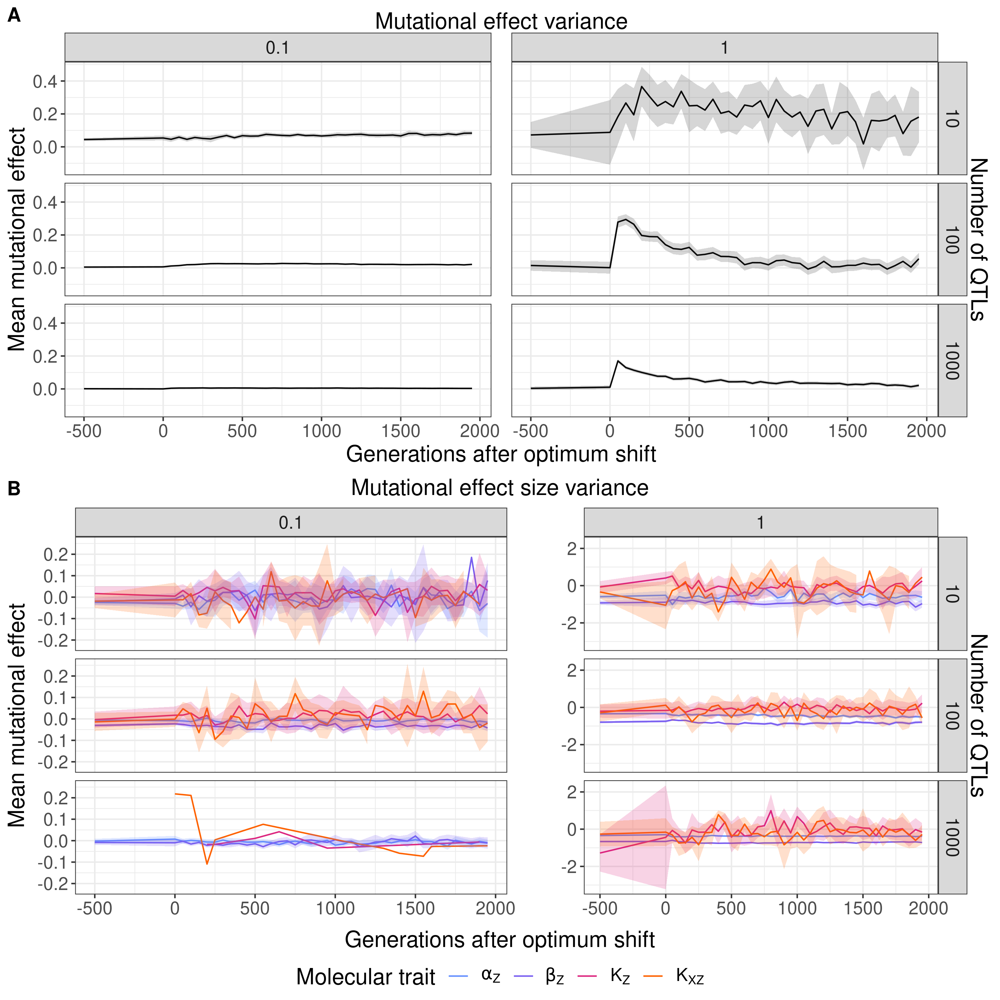
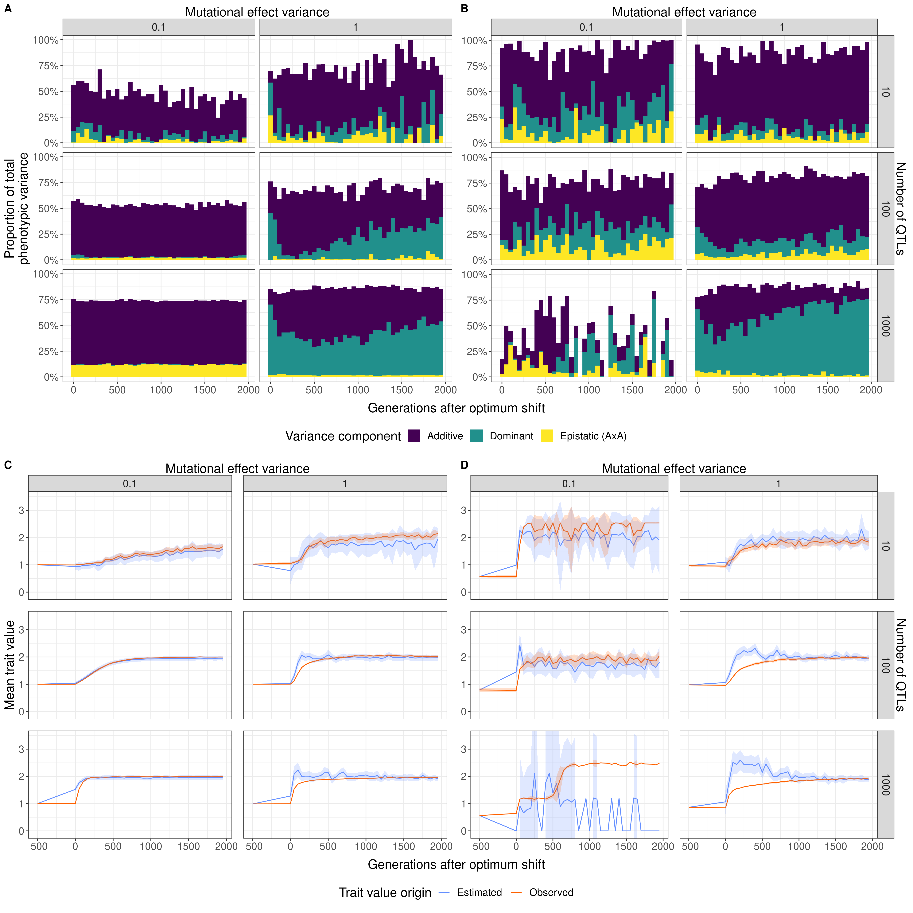

# Adapted population means

Here are figures of the adapted response to selection vs the average response of all populations (adapted and maladapted)

## Mean phenotype over time
### Adapted

### Total

## Site frequency spectrum after adaptation
### Adapted

### Total

## Mutational effect distribution after adaptation
A - Additive models
B - NAR models

### Adapted

### Total

## Mean frequency over time
A - Additive models
B - NAR models

### Adapted

### Total

## Mean mutational effect over time
A - Additive models
B - NAR models

### Adapted

### Total

## Mean heritability and predicted response over time
A, C - Additive models
B, D - NAR models
A, B - Proportions of phenotypic variance explained by additive, dominance, and AxA epistatic variance
C, D - Obsered mean phenotypic trajectories vs estimated responses to selection according to the Lande equation

### Adapted

### Total
