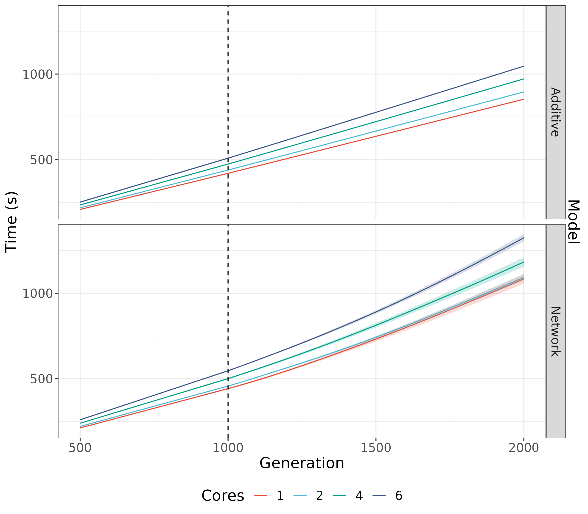

# Parallel SLiM speed test

In SLiM 5 multicore SLiM is available via Open MP. 
This test evaluates performance for differing numbers of cores for both additive and NAR models.



Both models run worse with multiple cores: running a profile showed that the main cost is in the
```addCrossed``` calls during reproduction. This is implemented in script in a for loop and is serial.
Since most of the cost of the model is serial, we see no performance gains and just the cost of 
delegating threads via OMP.
In the network model, ```NARIntegrate``` is a second cost. Interestingly, we see a non-linear increase in time
over the generations in the network model. This could be due to increased variability over time, with the genotype 
cache becoming less useful. In this case, we might be able to alleviate some costs by parallelising ```NARIntegrate``` when the genome is highly variable. However, in this case we would simply reduce the curvature and approach a linear
trend. 

The real performance improvement would be seen from parallelising ```addCrossed```, although I'm not sure that's possible/worth the effort. The problem is that the addCrossed calls the function ```_ProcessNewOffspring``` to add the individual's genomes to a ```std::vector``` via ```emplace_back```. 
A vectorised addCrossed could do the parallel processing of all individuals separately and then run ```emplace_back``` in serial.
