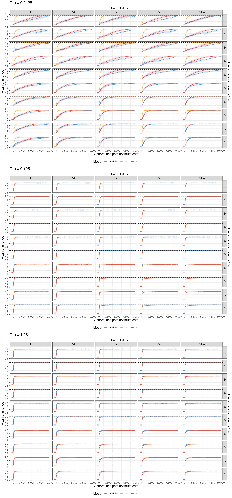

# Quantitative trait analysis

## Simulation/analysis summary
I explored the mean adaptation trajectory across 48 replicates for each of 430 WF models which adapted to the optimum. These models are combinations of different recombination rates, number of contributing loci contributing to a trait, mutational effect size  variance (tau), and a model: either an additive model or two forms of a NAR model (K+ has aZ, bZ, KZ and KXZ parameters as mutable components; K- has only aZ and bZ). Adapted models were those within 10% of the optimum at any generation between 59800 and 60000 (the last 200 generations of the simulation). 

## Average within-population phenotype means  

With weak mutation, recombination is very important for adaptation rate for additive and K- models, particularly when there are many contributing loci. Increasing recombination will increase the rate of adaptation for these models in this case. However, if there are too few loci, increased recombination won't do much, because there are fewer loci to break apart. The K+ architecture is less susceptible to this effect: it is generally faster to adapt than the other architectures, and is only mildly improved by increased recombination (again, when there are many loci).

With intermediate sized effects, recombination is far less important. all models adapt at a roughly similar speed, regardless of recombination or the number of loci. With high recombination and many loci, network models do tend to deviate from the optimum a little bit, sitting below it on average, whereas the additive is unaffected. 

With large mutational effects, there is a similar pattern to intermediate effects, however the maladaptation in network models is lost in high recombination settings. Increasing recombination here seems to have a deleterious effect when paired with increasing number of loci. Although the initial response seems unaffected, high recombination leads to a logarithmic approach to the optimum which takes longer than under low recombination. This affects all three models. The additive is on average faster than the NAR in all cases, although this is a marginal difference with low recombination.

### Discussion

Why might we see the recombination rate changing average adaptive trajectories differently depending on effect size and number of loci?

A constant across all effect sizes was that recombination rate's effects on the average adaptive trajectory depends on the number of loci. If there are only few loci for recombination to break apart, it will not have a large effect on adaptation. 

With small effects, adaptation might be mutation limited. Mutational variance is low relative to the distance to the optimum, so many mutations are needed to reach it. With recombination, it becomes easier for the population to combine mutations on different backgrounds, speeding adaptation. This is the Fisher-Muller hypothesis, and what we see with the additive and K- models. K+ is less affected by recombination in this scenario, which is consistently faster on average than any other model. This could reflect increased epistasis in this model compared to the others, increasing the effective mutation size of combinations. However, then recombination would be expected to decrease adaptation, unless many of these combinations are deleterious (i.e. high negative epistasis). There must be some positive epistasis to explain the increased rate of adaptation, but it must be a minority so that increased recombination helps separate those combinations from a deleterious genetic background.

In the intermediate mutational effect case, the models are all very similar in adaptation rate. However, it appears like recombination is slightly deleterious for the network models, as with high recombination they tend to hover below the optimum. However, the initial change in phenotype is faster than under no recombination, so it could be that increased variance from the larger effects creates more variability in the trait after adaptation which makes it more difficult for populations to hover accurately. The tendency to hover below instead of above could be chance, but is unlikely given the standard deviation of phenotype means between replicates is quite small. It instead might be a constraint that emerges as it becomes very rare to find a new mutation of small enough size that its epistatic effects aren't deleterious (overshooting by a large amount might be common with these effect sizes).

In the large effect size case, models are slower to adapt under high recombination. This is particularly true for the network models. However, this time the standard deviation of the mean within-population phenotype across replicates contains the optimum. So adaptation under this case is more precise (on average) than the intermediate effects. This might have to do with the average fitness effect of mutations. Under intermedate effect variance, although many mutations might have been deleterious, they may not have been strongly enough deleterious that they would be immediately removed by selection. Under the high effect size, the opportunity for mutations with negative fitness epistatic effects to persist is reduced due to the increased chance of a large effect size emerging.

Perhaps this will make more sense when we include information about the variance of populations

## Average within-population phenotypic variance

Under the low mutational variance case, there is relatively little variance in most cases. K+ has consistently higher variance than the other models, whereas K- and additive have consistently low variation. When recombination increases, there is little change in variance in the additive model. However, there is a sharp increase in the K+ model as new phenotype combinations are explored, followed by a gradual decline as optimal phenotypes are found. The size of this variance spike increases with recombination. The K- model follows the additive under low recombination, but has a delayed increase in variance under hgih recombination, settling at a stable level of standing phenotype variation higher than that of the additive.

Under intermediate effects and low recombination, the three models are very similar, maintaining similar variance and showing a small peak at the optimum shift. Under increasing recombination rates, they diverge: the additive model has a much smaller peak in variance at optimum shift time, but ends up maintaining that variance over the entire walk, whereas the K+ and K- variance behaves similarly to the K+ under small effects: an exponential decay, but this time with a greater peak and sharper decay in variance. 

Under large effects, the K+ model is a mess. There is a massive amount of variation in the variance over time and between models, indiciating the size of these interactions might be driving selection to remove large amounts of variation by either removing deleterious combinations or fixing beneficial ones. This appears across all recombination rates. The K- model behaves much the same as the intermediate case, but with again, a sharper exponential decay. The additive has a larger peak at the optimum shift, in line with the K- case, and again retains this variance longer than K-.

### Discussion

What does it mean?

