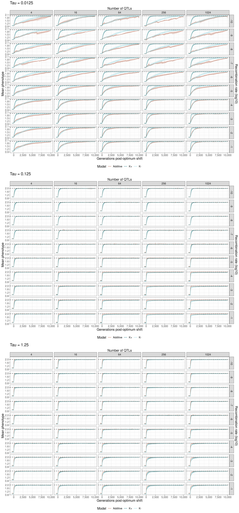
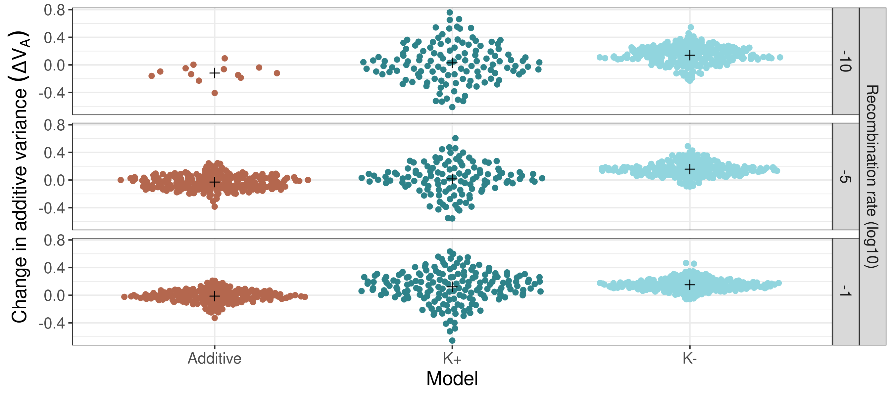

# Chapter 2 Analysis/Figures

## Questions

1. How dependent is an adaptive response on the genetic architecture of traits?
   1. Can genetic networks (e.g. NAR) buffer against more difficult genetic architectures (e.g. few loci, low recombination)?
      1. What does that look like in e.g. additive variance, phenotypic variance, phenotypic mean?
2. Recombination appears to be key to adaptation in this model: what is going on 
   1. What is the balance between breaking co-adapted gene complexes and separating deleterious combinations?
      1. Does the NAR network alter this equilibrium compared to the additive model?
   2. Negative fitness epistasis is a potential prerequisite for the evolution of recombination. Does the NAR model produce this? 
      1. Negative epistasis should generate negative LD to produce this selection for recombination: is this also seen? 

### Results

Adaptive rate increases the most with increasing recombination rate and many loci with small effects on average. This is the case for both additive and K- models, but K+ is less responsive to recombination: it already has a fast adaptation rate with very little recombination.
Larger effect sizes reduce the difference between models. This is likely because fewer mutations are required to reach the optimum, so recombination to find fit combinations is less important when only one or two mutations are required.
However, there is a difference in the phenotypic variance under larger effect sizes: the K+ model is highly unstable, with very large deviations, which would be lethal mutations.

So out of these architectures, the small effect size is the most interesting in terms of difference in adaptive rate, which is driven by recombination rate for models with more than a few loci (with very few loci, there is a lot of aggregation of alleles within genes which cannot be separated by recombination).

The rest of the analysis focuses on the small effect size case.

Why might the K+ configuration buffer against low recombination rates? Could be that there is a lot of positive fitness epistasis, which increases the efficiency of selection. This might also be aligned with increases in additive variance.

This figure shows that on average, there is positive fitness epistasis in both K+ and K- models, although marginally more in K+. This means that combinations of alleles are more synergistic in effect than the additive model, which should mean an increase in additive variance.

This figure shows that additive variance is substantially higher in K+ models than additive or K- in both low recombination and high recombination systems. This matches the response to selection quite well, with the marginally faster adaptation in K- relative to additive matching with slightly elevated VA. 

With high recombination, additive variance increases over the walk for the networks but not for the additive model. This might be from cryptic additive variance being released due to splitting interactions between loci? But since epistasis is largely positive, seems strange that there would be an increase in variance by splitting apart synergistic combinations. This is only pairwise epistasis, maybe multiway is important as well? 

Positive epistasis should create positive LD, do we see that?

Not really... recombination definitely reduces LD on both sides, but there is an equal level of positive and negative LD for all models. The NAR models do have more variability in the proportion of pairs with 0 D though under low recombination. 

This is not adjusted for the frequency of alleles though: alleles at very low frequency might be driving this pattern.

In this figure we have LD between pairs of alleles with frequency within 10% of each other and at frequency greater than 10%. Again, there is not much of a noticeable pattern, and it is difficult to discern the additive models due to a lack of estimates. 

So if there is positive epistasis but it isn't driving much of a pattern in LD, why do the network models respond differently to recombination than the additive (K+ especially)? Hill-Robertson effects?