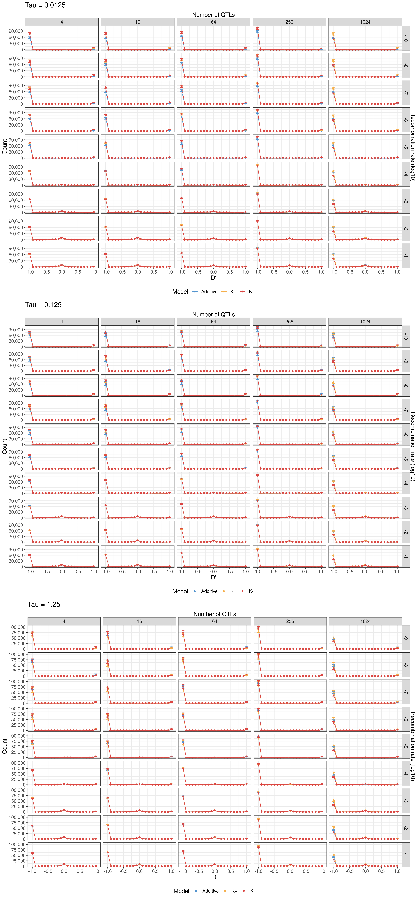
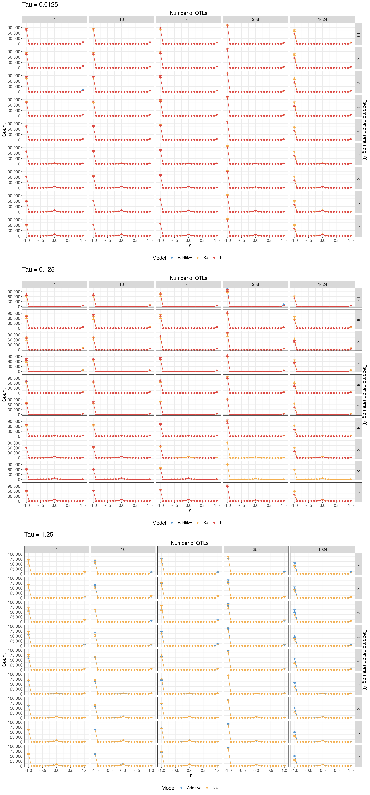
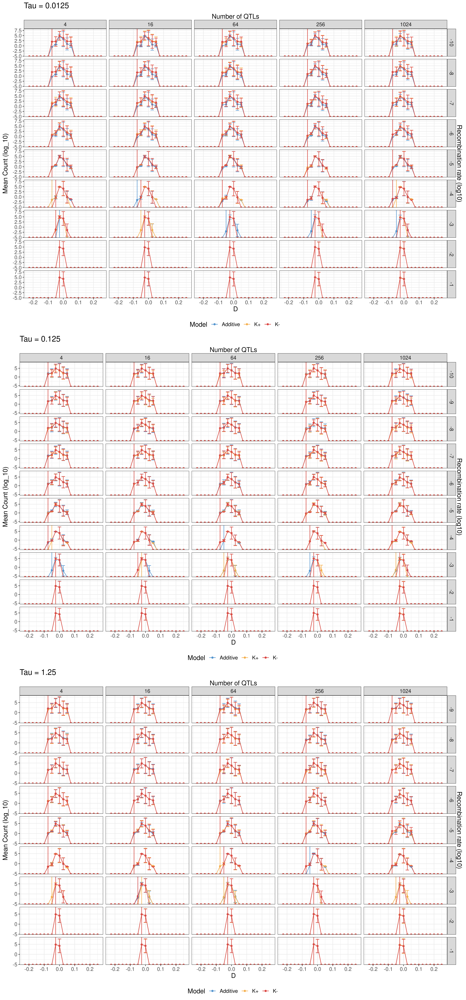
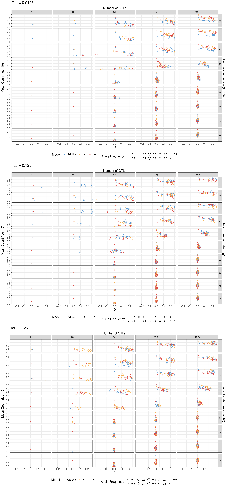
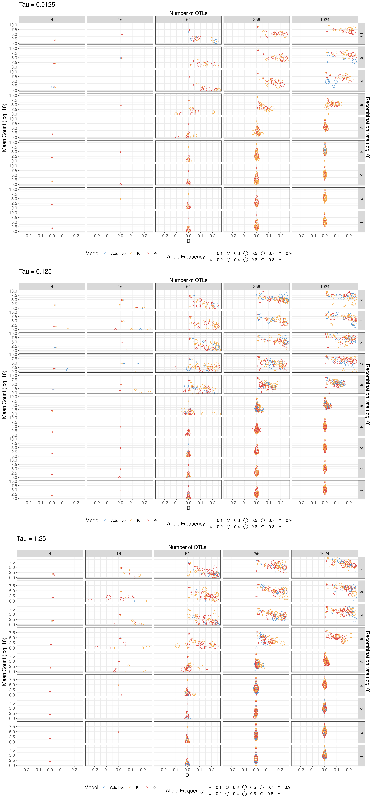

# Linkage disequilibrium

I calculated pairwise LD for all biallelic locus pairs at up to four stages during adaptation: when populations reached 25%, 50%, 75%, and 90% of the way to the optimum. I used Lewontin's D' statistic, which ranges from -1 to 1. Imagine we have two alleles at different genes, A and B. D' = -1 means that A is always on a different genetic background to B, or vice versa. D' = 1 means that A and B are always inherited together. D' = 0 means there is no LD.

The expectation is that positive epistasis can generate positive LD by favouring the inheritance of coadapted gene complexes. Likewise, negative epistasis favours interacting loci to be inherited separately, leading to an excess of negative LD. Negative LD can persist in the population for long periods, as the combinations together tend to reduce the genetic variance in fitness and thus the rate of adaptation. So, if populations harbour large amounts of negative LD (either generated by negative epistasis or by stabilising selection), recombination should be favoured to increase the variance in fitness, increasing the rate of adaptation.

## Results

This figure shows the distribution of LD after adaptation.
The persistent trend is that increasing recombination reduces the number of biallelic sites, leading to smaller counts and it increases the amount of unlinked sites. Negative LD is much higher than positive LD in all models, so recombination should be favoured. We found a lot of positive epistasis in these models, so this LD seems to be generated moreso by selection than by the epistasis itself. The evidence for this is that the additive model has similarly negative LD as well as the NAR models. 

Did this look any different at the start of the adaptive walk?

Overall what have we seen?

- Models produce positive fitness epistasis, but negative LD (seems illogical?)
- K+ produces slightly positive trait epistasis, K- produces slightly negative trait epistasis (aside from outliers with very large trait epistasis)
- Adaptation is affected by recombination when there are many loci and increases the response to selection depending on the size of effects
  - with small effects, recombination greatly improves additive and K- models the most, K+ is barely affected (it started fast): K+ is resilient to small effects
  - with larger effects, NAR models slows down with increasing recombination, and with really big effects, the additive model does as well
- Phenotypic variance is similar: increased with recombination in all models, depending on tau
  - small effects: K+ is most increased
  - moderate effects: NAR models similar, additive increases and stays stable over time
  - large effects: K+ is unstable, K- can't maintain as much variance, big spike in variance with increased recombination in K- and additive
- LD seems to decrease with recombination under K- and additive more readily than K+

## D and frequency-dependent LD

Because D' is susceptible to skewing by low allele frequencies, I reran the analysis with D instead, which ranges from -0.25 to 0.25 instead of -1 - 1. I also calculated D between alleles with similar frequencies (within 10% of each other) to investigate if alleles at certain frequencies contributed differently to LD.

First, the distribution across all frequencies:

So across all models, increasing recombination reduces the magnitude of LD. What is that really high variance negative LD spike in all of them? Why is it consistent? Why are there few mutations with that D?
Very similar across all models - not exactly the same. Effect size doesn't appear to have much impact, neither does number of loci: so even though the response to selection appears to depend on number of loci/recombination interaction, not the case for LD (nor epistasis? Have to check)

Now frequency dependent LD. The allele frequency here refers to the upper limit of allele frequency for both loci being measured (e.g. an allele frequency of 0.1 means that both loci have minor allele frequencies between 0 and 0.1). Each circle is a mean across 48 replicate simulations.

So in this case, we see that number of loci does have an effect: because there are fewer loci, it is less likely for pairs to have similar frequencies, so there are far fewer samples, making it harder to interpret the results.
For the other cases though, what we see is that the three models are similar: loci with intermediate allele frequencies contribute to positive LD when there is low recombination, but there is little difference under high recombination. This could be a survivorship bias problem: when recombination is low, even though two loci might be in positive LD, they might be in negative LD with other loci along the genome. This is a Hill-Robertson effect. Under high recombination, the positive LD is not constrained to a deleterious background and so it is quickly fixed/purged by selection. How do we test this? What are the alternative explanations?

This result mirrors the epistasis finding pretty well: an excess of positive epistasis with an excess of positive LD (for some allele frequencies). However, all three models are pretty similar in this LD measurement, whereas there was more difference between them in epistasis. Potentially due to the masking of the genetic background?

The plot before the optimum shift is similar:

