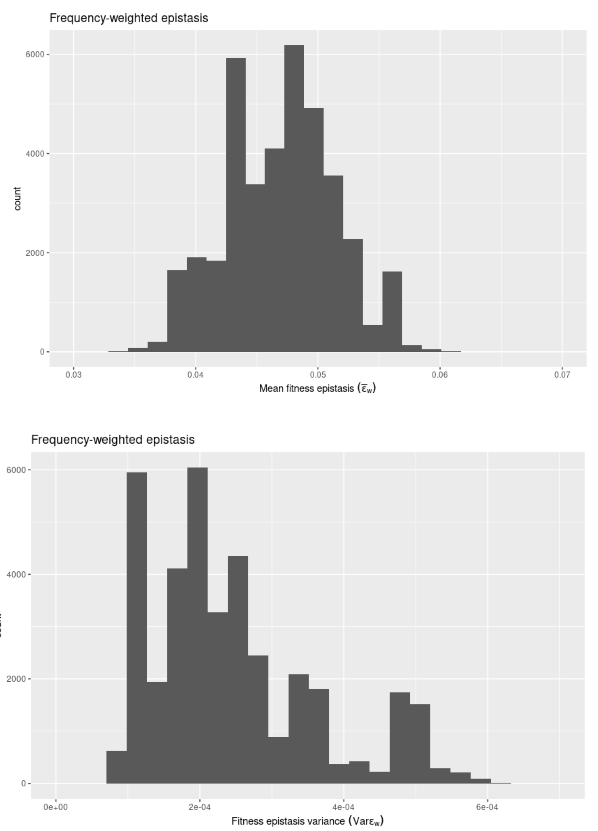

# Mutation data statistics: epistasis, SFS, DFE

In this experiment, I'm estimating trait and fitness epistasis from mutation data using a subsampling design:

We first sample 2m mutations from the distribution of mutations per model, generation, and seed. This gives us two vector of m mutations we label a and b. We also extract the wildtype values for the molecular components for the model, gen, seed combination. We use the NAR ODE solution to calculate the phenotype with a's mutation added, b's, and with both. We can then plug this into the epistasis equation to calculate fitness epistasis, and similarly for trait epistasis (( P_ab - P_wt ) - ( ( P_a - P_wt ) + ( P_b - P_wt ) ) where P_wt is the wildtype phenotype). This is done for each combination of the 2m sampled mutations. We calculate the mean epistasis over the 2m mutations, as well as the variance. The means are grouped by the mutation type comparison: for example, mean epistasis for a = $\alpha_Z$ and b = $\beta_Z$, or the mean across a = $\beta_Z$ and b = $\beta_Z$. We then repeat this process n times to get a distribution of the epistasis estimates.

But how many m is enough? Seems to be a tricky question in general from what I can find. The smaller m is, the more wide the final variance in estimates will be, regardless of n. It's also limited by computational time and memory usage: calculating the phenotypes for the combinations is expensive and is O(2^m). I've been testing with m = 48, and these are the results I get for a small number of iterations (n = 100):

and for fitness epistasis:

Another problem is that this uniform mutation sampling approach might be affected by overrepresenting very rare alleles since they are equally likely to be sampled as common alleles. So I've also weighted the sampling by allele frequencies to see what happens:

and for fitness epistasis:

