# Epistasis differences between models

I calculated pairwise fitness and trait epistasis between randomly sampled mutations across all adapted populations in my SLiM experiment. Epistasis was calculated at four timesteps: when the populations reached 25%, 50%, 75%, and 90% of the distance to the optimum. There are three models tested: additive, K-, and K+. K- and K+ are the NAR circuit, with the K molecular components fixed or mutable, respectively. In K- the only evolvable molecular components are $\alpha_Z$ and $\beta_Z$. Each model was tested under a variety of genetic architectures, including different recombination rates, numbers of QTLs, and different mutational effect size variances (different widths of the sampling distributions of new mutations' effects).

The question was if trait and fitness epistasis persist under certain genetic architectures more readily than in others. I predicted that recombination rate would be correlated with persisting trait epistasis: as recombination can break apart deleterious combinations, higher recombination rates might allow for trait epistasis to be maintained in the population at higher levels than when linkage is strong. However, this might be balanced by recombination's ability to break apart coadapted gene complexes: so an intermediate rate might be required. When mutational variance is high, there is likely also more opportunity for epistasis to persist due to epistasis being a multiplicative process: larger mutations have a larger opportunity for larger effect interactions. The number of loci might interact with recombination rate: when there are more loci, there is more opportunity for linkage to create either maladaptive or coadapted gene combinations. So with more loci, high recombination should have more of an effect on epistasis. With fewer loci, epistasis could persist with lower recombination rates, as the greater average distance between loci will mean that there is a higher chance for the alleles to be separated by recombination.

In terms of fitness epistasis, selection should create an environment where negative epistasis persists, as positive epistatic interactions should be selected quickly due to the increased variance in fitness. So in models with low recombination, there should be a bias towards negative epistasis (as the positive LD produced by positive epistasis should create efficient selection for these combinations). This should particularly be the case in high mutational variance models with many loci, where the opportunity for linkage to generate large effect combinations is highest.

I calculated epistasis by randomly sampling pairs of mutations. However, some of these mutations were very rare, which might have skewed the distributions of epistasis experienced by the population. Hence, I additionally did the sampling with weighting by allele frequency and compared the results. I predicted that the frequency-adjusted sampling might have a narrower distribution of epistasis with a shorter tail.  

The below figures show the means and selected distributions of epistasis at the final timepoint, where populations had just reached the optimum (+/- 10%). One model (index 396: 16 loci, 1.25 mutational variance, 0.01 recombination, K+ model) was removed due to outlier combinations creating very large phenotypes

First, I explored the mean behaviour of epistasis across all models. Each point is an average of a model across all simulation replicates (seeds) and mutation pairs:
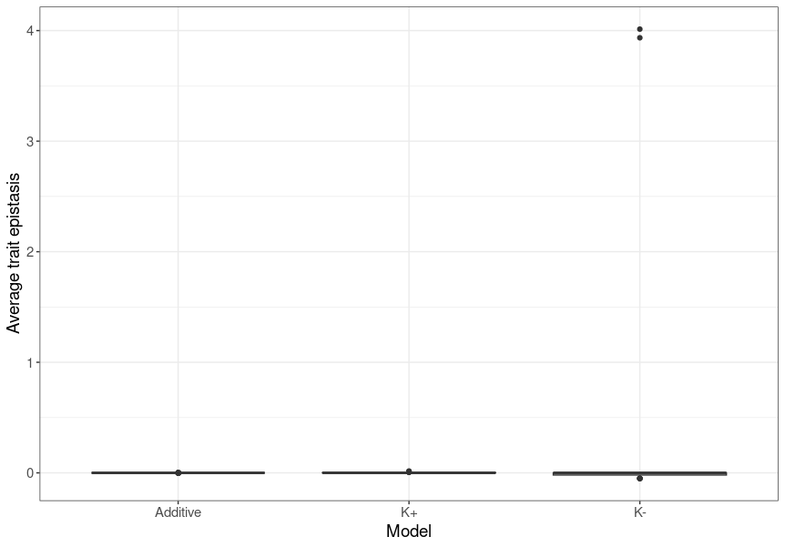

Mostly, trait epistasis was on average close to 0. This is the case by definition with the additive model, but in both NAR models, it rarely deviated. This could be because of averaging across alleles with both positive and negative epistasis, which we will explore when we look at the distributions. There are also a couple of outliers in the K- model which produce large amounts of synergistic trait epistasis. 
Ignoring these outliers, the distribution is much closer to 0:

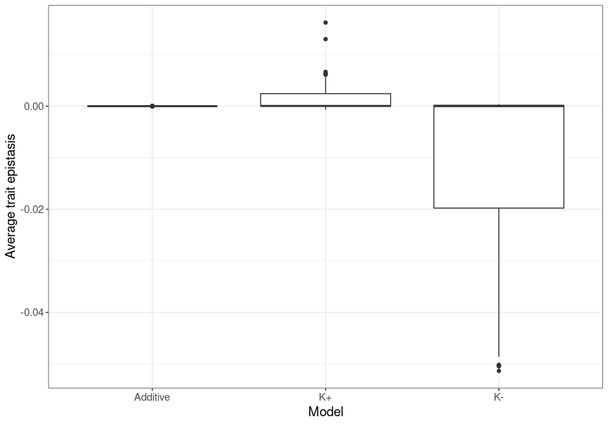

The slightly negative average trait epistasis in K- is surprisingly compared to K+ being slightly positive, but the difference is so small I'm unsure it means anything and isn't just sampling error.

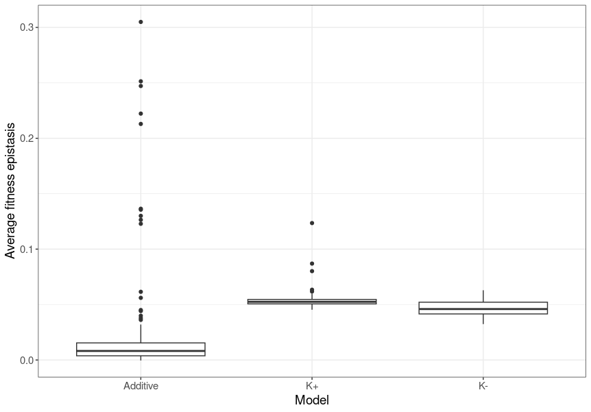

Fitness epistasis is very interesting. The Additive model has mostly lower fitness epistasis than the NAR models, but some quite extreme outliers that don't exist in the NAR models. Average fitness epistasis in K+ is less variable between genetic architectures than K-. This might reflect the roles of the K coefficients in fine-tuning expression?

But what are the genetic architectures underpinning these differences? Let's have a look:

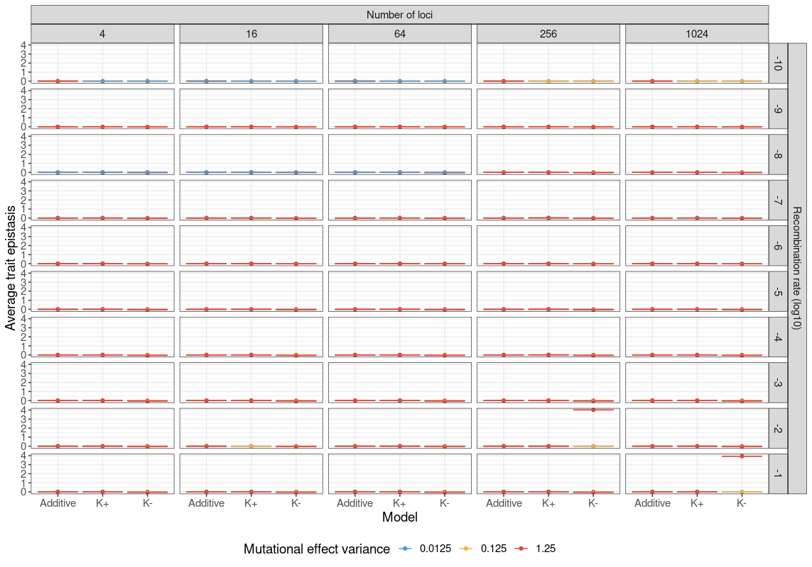

Those outliers with high trait epistasis come from models with high recombination, many loci, and high mutational variance. But only in the K- case, where there aren't any K coefficients for fine tuning (?)
The rest of the models are pretty similar, even when we zoom in:

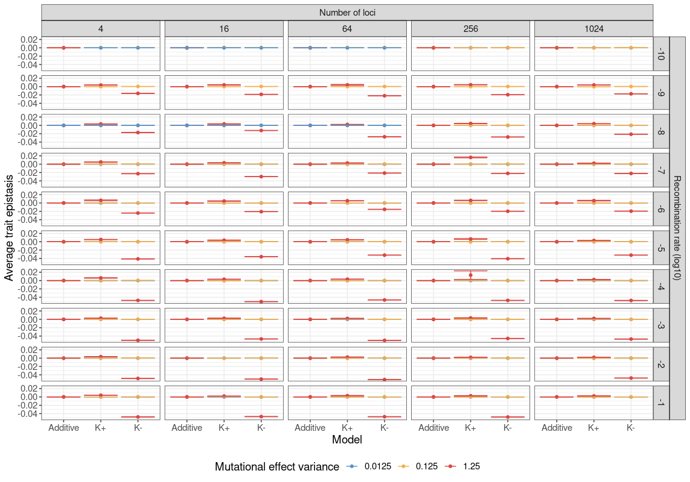

Interesting that consistently the K- models with high mutational variance have on average more negative trait epistasis, and that this gap from the other mutational variance levels shrinks with decreasing recombination rate: except for the two outlier cases.

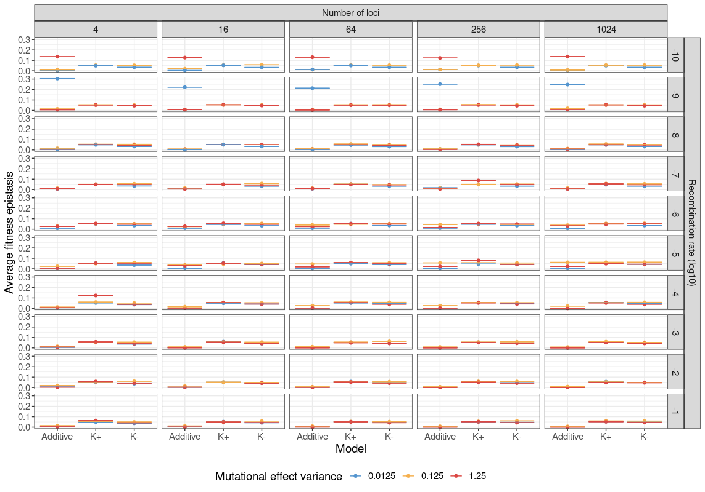

Fitness epistasis: additive models, most extreme positive fitness epistasis exists when there is low recombination and low mutational effect variance. Not affected by the number of loci. Not the case with the NAR models, fitness epistasis is really stable across genetic architectures.

I've identified that trait epistasis is highest in cases with many loci, high mutational variance, and strong recombination, but this doesn't correlate with changes in fitness epistasis. Why might this happen? If the mutations are individually deleterious as well? If this is the case, the frequency-weighted sampling might show different results

The below figures show the means across frequency-weighted samples (same as above, but the mutation samples were weighted by allele frequency).

More or less the same: those two outliers in K- still exist here, likely high frequency (will have to check).

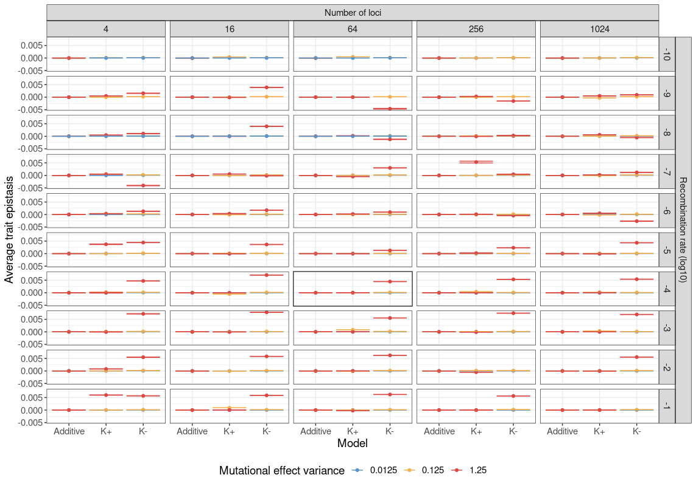

Taking out those extreme values reveal that the frequency weighting has brought the average trait epistasis closer to 0 across all models. It has also flipped the mutational variance effect in K-: instead of being aligned with reduced trait epistasis, it's aligned with increased variance. Similar pattern with the signal vanishing with recombination rate.

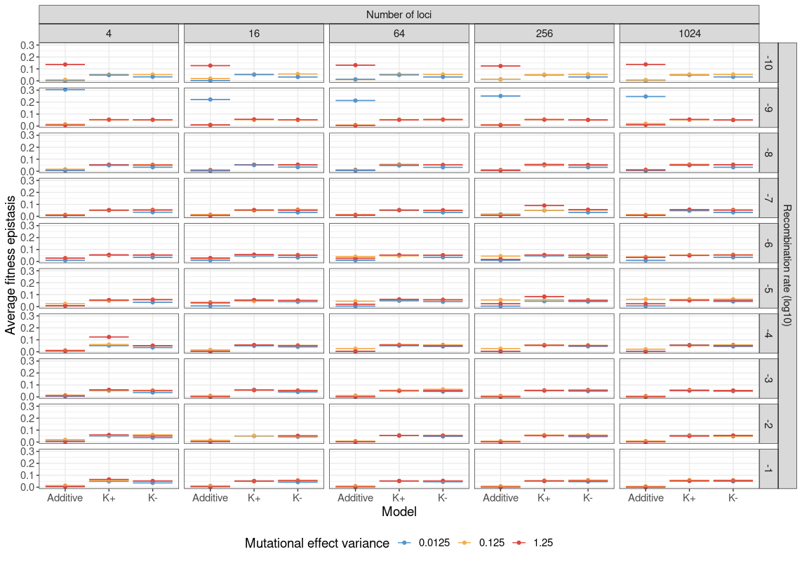

No difference whatsoever with fitness epistasis.

So we have the means, but there could be a balance between negative and positive epistasis which is causing the means to go around 0. Lets have a look at the distributions of epistasis in the outlier K- case with high mutational variance, many loci, and high recombination:

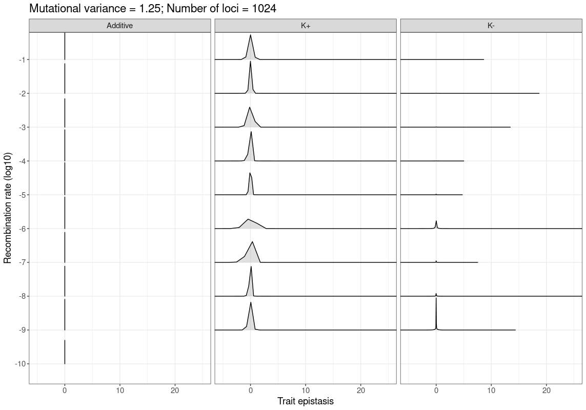

NAR has long tails of mutations with very strong trait epistasis. K+ is much more centralised around 0, K- is as well, but to a lesser degree. But when we sample by frequency:

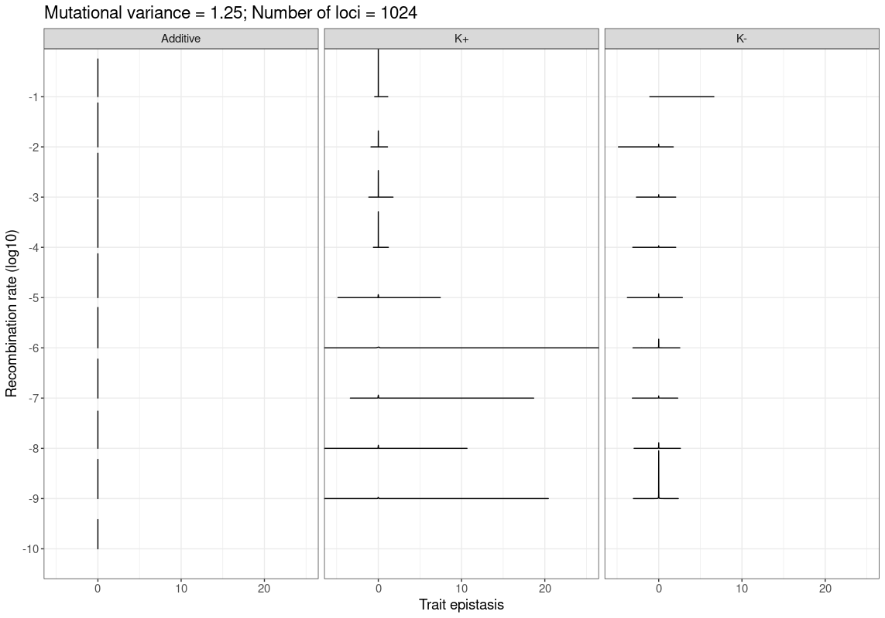

Massive reduction in those tails: those long tails are deleterious. There's also a signal in the high recombination rate K- which shows the difference in means from before. K+ has long tails of trait epistasis at high frequency with low recombination: selection is inefficient (?)

Now for fitness epistasis:
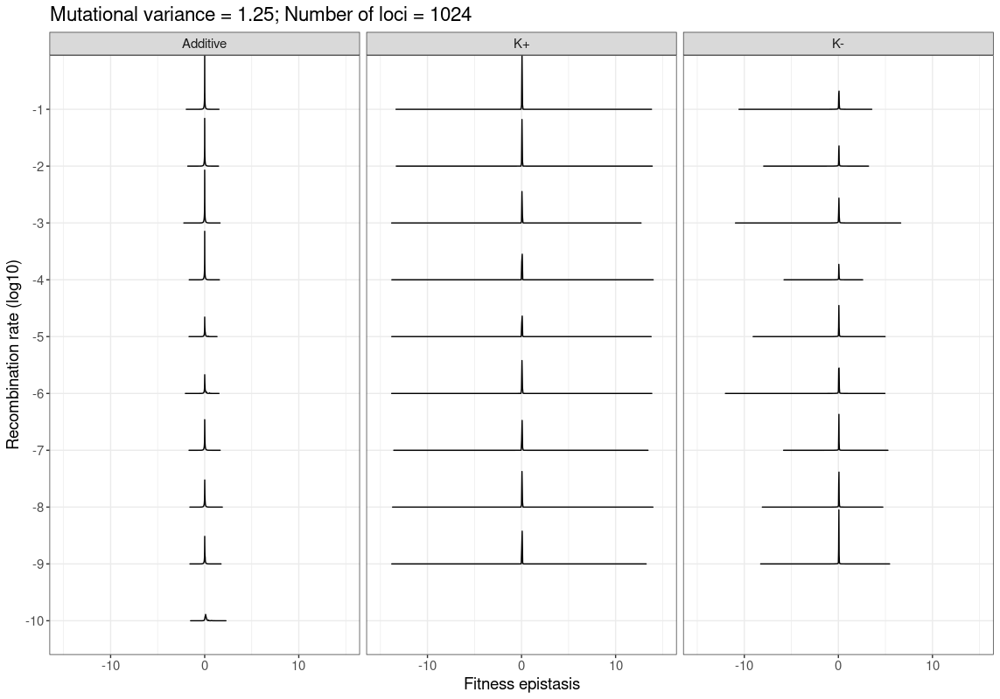

Look at K- long tail of negative fitness epistasis! K+ also has huge tails, but more evenly distributed. Interestingly, recombination seems to matter more for the additive than non-additive: higher recombination results in mutation combinations with closer to 0 epistasis for additive. Do these signals persist when we look at frequency-weighted samples?

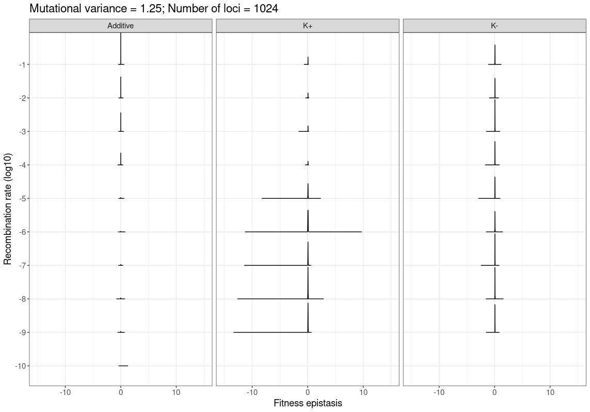

Some of them... The additive case is even more extreme. K+ has a long tail of negative epistasis with low recombination, but this declines with higher recombination. K- shows no real pattern - mostly centred around zero, maybe a slight negative skew.

What's next? 

- Look at the other extreme case to see if similar distributions of epistasis exist
- Compare distributions of epistasis with opposite cases: what about a more typical case, where the mean isn't extreme?
- See what's happening with the adaptive walk in these models: does trait epistasis correlate with the rate of adaptation?
- How does VA change over the adaptive walk? Is this correlated with epistasis?
- Does the distribution of fitness effects change between the extreme models?
- Does the SFS change between models? 
- How might other networks change these distributions of epistasis? NAR accelerates response to environmental cues. What about a network which slows responses? (e.g. positive auto regulation). What about delayed responses? C1-FFL? 