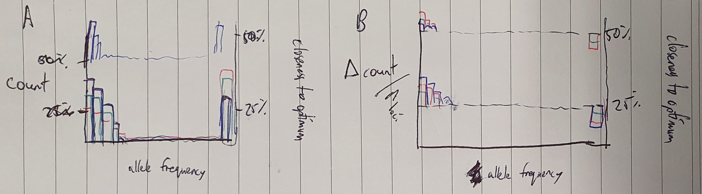
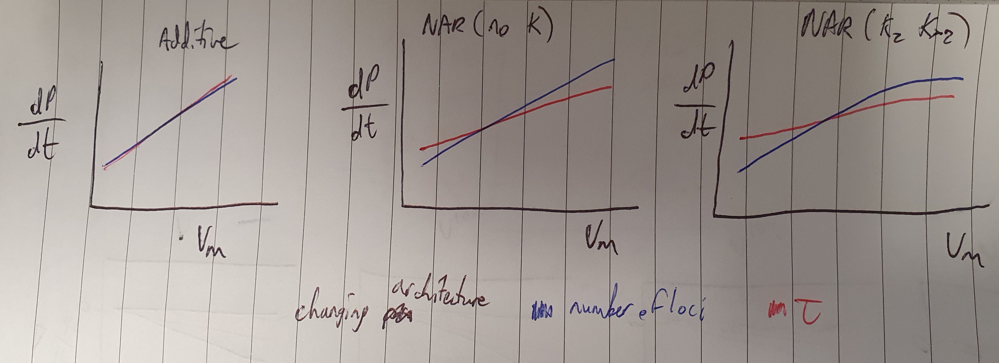

# Chapter 2: The genetic architecture of polygenic adaptation under a network-derived trait

Q: How does genetic architecture influence the
- Rate of adaptation
- Probability of adaptation

Genetic architecture:
- number of loci
- distribution of allelic effects ($\tau$)
  - normal vs double exponential distribution (fat-tailed) ?
- recombination rate/LD
- GP map complexity (network aZ bZ only/network KZ KXZ/additive)

Q: How do these components of the genetic architecture influence the heritability and adaptability of traits?
- G matrix (among molecular components)
- Epistasis (pairwise)
  - $\epsilon = ln(w_{ab}) - ln(w_{a}) - ln(w_{b})$
  - $\epsilon_P = P_{ab} - P_{a} - P_{b}$

Rate of adaptation
$\bar{dP/dt}$: average change in phenotype over time

Measure change in G, $\epsilon$, $\bar{dP/dt}$ per unit change in genetic architecture parameters
- Requires a linear relationship between genetic architecture parameters and responses
- What if the relationship isn't linear?
  - Maybe we can transform it, otherwise we can compare a few thresholds where there is a change in the effect
- Also missing interactions between genetic architecture parameters

Examples:
$\Delta \bar{dP/dt}$

$\Delta$ SFS

We'll have these 4 panel figures for:
- $\bar{dP/dt}$
- SFS
- $h^2$
- $\bar{\epsilon_P}$

Mutational variance
$V_m = 2n_{loci}\mu\tau^2$
In additive models it might not matter whether it is the number of loci or $\tau$ that changes, but it probably will matter for network models
So measuring the relationship between nloci and $\tau$ vs $V_m$ could be important e.g.

Supplementary - continuous trends for each input

G matrix

Parameter sweep across three variables:
- Recombination rate [0 - 0.5]
- Number of loci [1 - 1000]
- Mutational effect size variance [0.01 - 1.5]

256 samples to minimise correlations between parameters, maximise coverage

When the number of loci increases, h^2 should increase, as the mutational target is so large and mutational effects
should be favoured to be very small to compensate for the higher effective mutation rate. When mutational effect
size variance is small, this should be particularly apparent - we should approach an infinitesimal model.
Recombination rate will further this - with free recombination, non-additivity should be less frequent.

Measurements
- Heterozygosity
- Phenotype means (and a sample of individuals as well to get an estimated distribution of phenotypes)
- Haplotypes (for heritability estimation)
- Allele frequencies and effect sizes
- Pairwise LD
