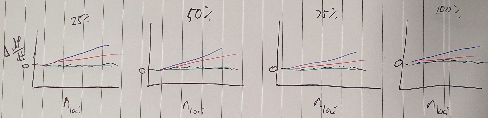

# Chapter 2: The genetic architecture of polygenic adaptation under a network-derived trait

## Questions, input, and output
Q: How does genetic architecture influence the
- Rate of adaptation
- Probability of adaptation

Genetic architecture:
- number of loci
- distribution of allelic effects ($\tau$)
  - normal vs double exponential distribution (fat-tailed) ?
- recombination rate/LD
- GP map complexity (network aZ bZ only/network KZ KXZ/additive)

Q: How do these components of the genetic architecture influence the heritability and adaptability of traits?
- G matrix (among molecular components)
- Epistasis (pairwise)
  - $\epsilon = ln(w_{ab}) - ln(w_{a}) - ln(w_{b})$
  - $\epsilon_P = P_{ab} - P_{a} - P_{b}$

Rate of adaptation
$\bar{dP/dt}$: average change in phenotype over time

Measure change in G, $\epsilon$, $\bar{dP/dt}$ per unit change in genetic architecture parameters
- Requires a linear relationship between genetic architecture parameters and responses
- What if the relationship isn't linear?
  - Maybe we can transform it, otherwise we can compare a few thresholds where there is a change in the effect
- Also missing interactions between genetic architecture parameters

Examples:
$\Delta \bar{dP/dt}$

    

$\Delta$ SFS

    

We'll have these 4 panel figures for:
- $\bar{dP/dt}$
- SFS
- $h^2$
- $\bar{\epsilon_P}$

Mutational variance
$V_m = 2n_{loci}\mu\tau^2$
In additive models it might not matter whether it is the number of loci or $\tau$ that changes, but it probably will matter for network models
So measuring the relationship between nloci and $\tau$ vs $V_m$ could be important e.g.

    

Supplementary - continuous trends for each input

G matrix: extract the log-transformed molecular component values?
Estimate using sommer?

Parameter sweep across three variables:
- Recombination rate [0 - 0.5]
- Number of loci [1 - 1000]
- Mutational effect size variance [0.01 - 1.5]

## File size/time estimation
### File size
- 144 samples to minimise correlations between parameters, maximise coverage
- 50 replicates per model
- This is repeated three times: additive, NAR, NAR with KXZ and KZ
- 144 samples * 50 replicates * 3 models = 21,600 simulations
- 201 samples per adaptation run (every 50 generations) + 100 burnin (every 500 generations)
- 301 samples
- per sample file sizes (per sim file size): 
  - slim_qg = 115 bytes (34615 bytes)
  - slim_indPheno = 599 bytes (180299 bytes)
  - slim_muts = 72 bytes per mutation (assuming max 500 mutations: 8610707 bytes)
  - slim_locusHo = 5000 bytes (1505000 bytes)
  - slim_sampled_pheno = 9000 bytes (2709000 bytes)
  - slim_sampled_moltrait = 35000 bytes (10535 kb)
  - slim_fx = 4500 bytes (1354500 bytes)
  - slim_popstate = 500 kb (500 kb - end of burn-in)
  - slim_haplos = ~1741 bytes (351682 bytes (only sample during test and at end of burn-in - 202 samples))
  - slim_PMmat = 107 bytes (21614 bytes)
  - out_slim_ld = 7 MB (14 MB for two samples)
    - should also optimise (but low priority: we can still store that since it's only 2 samples)

Total per sim: 39.8 MB

Total for experiment: 859.7 GB

### Time estimation/job cost
- 18 service units per simulation average
- 21,600 * 18 = 388,800 SUs
- Simulations are worst-case 15 hours
- 15 * 21,600 = 324,000 CPU hours
- 21,600/1,440 cores = 15 jobs
- 15 * 15 = 225 total hours, ~9.4 days runtime excluding queue time

## TODO:
- Optimise NAR solution for highly variable populations
  - cache is not effective, will need to parallelise solutions when unique individuals is high
- Could sample less often? 
- If we're going for discrete timesteps, only measure
some things when pops reach that?
  - In that case we have maybe 4 timesteps, which means simulations would take ~860KB + 14MB LD plot
  - Reduces total cost to 321GB (and most of that is in the LD matrices which are sparse)
  - Risk that we miss something in the interim, but if we always save data when populations reach 25%, 50%, 75%, 100%, there's consistency in the sampling

## Predictions

When the number of loci increases, $h^2$ should increase, as the mutational target is so large and mutational effects
should be favoured to be very small to compensate for the higher effective mutation rate. When mutational effect
size variance is small, this should be particularly apparent - we should approach an infinitesimal model.
Recombination rate will further this - with free recombination, non-additivity should be less frequent.

Measurements
- Heterozygosity
- Phenotype means (and a sample of individuals as well to get an estimated distribution of phenotypes)
- Haplotypes (for heritability estimation)
- Allele frequencies and effect sizes
- Pairwise LD
